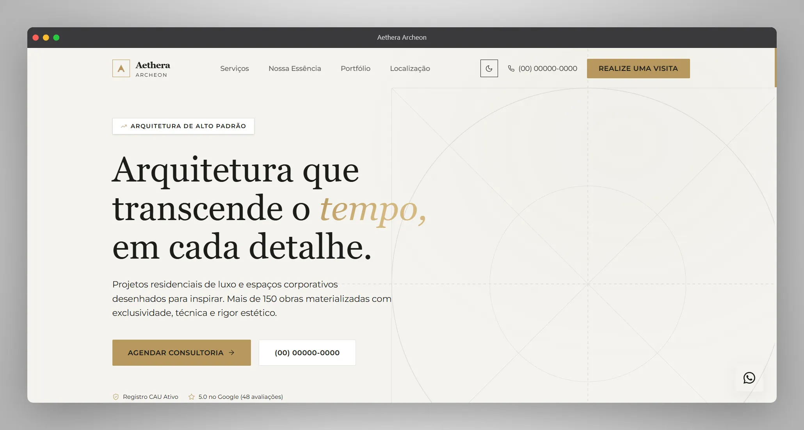

<p align="center">
  <a href="https://nextjs.org/"></a>
  <a href="https://www.typescriptlang.org/"></a>
  <a href="https://tailwindcss.com/"></a>
  <a href="https://www.framer.com/motion/"></a>
  <a href="https://analytics.google.com/"></a>
  <a href="https://lucide.dev/"></a>
  <a href="https://vercel.com/"></a>
</p>

# 🏛️ Aethera Archeon



> **Premium Architecture Landing Page**  
> Template de altíssimo padrão para escritórios de arquitetura, design de interiores e construtoras de luxo.

Projeto desenvolvido como **peça de portfólio**, com foco em engenharia front-end moderna, organização escalável de código, experiência visual refinada e arquitetura preparada para white-label.

_Nota: Todas as informações e marcas exibidas neste projeto são inteiramente fictícias e servem apenas como demonstração técnica de competência em engenharia de software frontend._

---

## ✨ Visão geral

**Aethera Archeon** é uma landing page premium pensada para marcas do segmento arquitetônico que exigem presença digital sofisticada, performance elevada e estrutura de código limpa.

Além do apelo visual, o projeto foi construído para demonstrar:

- organização escalável de componentes;
- separação clara entre conteúdo e interface;
- tipagem forte com TypeScript;
- sistema de tema com Dark/Light Mode;
- animações suaves com foco em elegância visual;
- fundamentos de SEO técnico aplicados nativamente.

---

## 🧠 Diferenciais técnicos

### Arquitetura orientada à escalabilidade

O projeto segue uma base organizada para facilitar manutenção, expansão e reaproveitamento em outros contextos premium.

- **Separação de responsabilidades:** textos, links, rótulos e conteúdos ficam centralizados em `lib/constants.ts`.
- **Componentização consistente:** a interface é dividida em seções sem acoplamento desnecessário.
- **Tipagem estrita:** contratos centralizados em `types/index.ts` garantem previsibilidade e segurança.
- **White-label friendly:** alterações de conteúdo e identidade podem ser feitas com mínimo impacto estrutural.

### Design system e experiência visual

A interface foi planejada como um sistema visual coeso, com tokens reutilizáveis e foco em acabamento.

- **Dark/Light Mode** com identidade própria para cada tema.
- **Variáveis CSS globais** para controle de cor, contraste e consistência visual.
- **Motion design refinado** com microinterações e scroll reveals suaves.
- **Estética editorial/premium** voltada para negócios de alto padrão.

### SEO e fundamentos de produção

A base do projeto também contempla preocupações comuns de projetos reais em produção.

- Geração dinâmica de `sitemap.xml`.
- Geração dinâmica de `robots.txt`.
- Metadados estruturados no `layout.tsx`.
- Suporte a JSON-LD com `Schema.org`.
- Preparação para URL canônica e ferramentas analíticas.

---

## 🛠️ Stack tecnológica

| Tecnologia                  | Função                                                                             |
| --------------------------- | ---------------------------------------------------------------------------------- |
| **Next.js 15** (App Router) | Framework React com renderização moderna, roteamento e estrutura de aplicação.     |
| **TypeScript**              | Tipagem estrita para maior segurança e previsibilidade.                            |
| **Tailwind CSS**            | Estilização utilitária com excelente produtividade e integração com design tokens. |
| **Framer Motion**           | Animações e microinterações com fluidez e controle refinado.                       |
| **Lucide React**            | Ícones SVG leves, consistentes e semanticamente adequados.                         |
| **next-themes**             | Gerenciamento de tema com suporte a light, dark e preferência do sistema.          |
| **@next/third-parties**     | Integração otimizada de scripts externos, como Google Analytics.                   |

---

## 📁 Estrutura principal

```text
aethera-archeon/
├── app/
│   ├── globals.css            # Variáveis CSS, tokens e base visual
│   ├── layout.tsx             # Metadados, providers, SEO e JSON-LD
│   ├── page.tsx               # Orquestração das seções da landing page
│   ├── robots.ts              # Geração de robots.txt
│   └── sitemap.ts             # Geração de sitemap.xml
├── components/
│   ├── providers/
│   │   └── theme-provider.tsx # Configuração de temas com next-themes
│   ├── sections/              # Seções principais da landing page
│   └── ui/                    # Componentes reutilizáveis
├── lib/
│   └── constants.ts           # Fonte central de conteúdo e configurações
└── types/
    └── index.ts               # Tipos e contratos TypeScript
```

---

## 🚀 Setup local

### 1) Clonar o repositório

```bash
git clone https://github.com/strattegia-mp3/aethera-archeon.git
cd aethera-archeon
```

### 2) Instalar as dependências

```bash
npm install
# ou
pnpm install
```

### 3) Configurar as variáveis de ambiente

```bash
cp .env.example .env.local
```

### 4) Iniciar o ambiente de desenvolvimento

```bash
npm run dev
```

Abra no navegador:

```text
http://localhost:3000
```

---

## ⚙️ Variáveis de ambiente

Crie um arquivo `.env.local` com os valores necessários para ambiente local ou produção.

```env
# URL pública do projeto
NEXT_PUBLIC_SITE_URL=http://localhost:3000

# Google Analytics (opcional)
NEXT_PUBLIC_GA_MEASUREMENT_ID=G-XXXXXXXXXX
```

### Observações

- `NEXT_PUBLIC_SITE_URL` é importante para SEO técnico, links canônicos e geração correta de sitemap.
- `NEXT_PUBLIC_GA_MEASUREMENT_ID` é opcional e pode ser omitido em ambientes sem analytics.

---

## 🎨 Personalização white-label

A estrutura do projeto foi pensada para permitir adaptação rápida para outros escritórios, marcas ou nichos premium.

### 1) Alterar textos, serviços e contatos

Edite o arquivo:

```text
lib/constants.ts
```

Todo o conteúdo estratégico do site está centralizado nele, incluindo:

- hero;
- sobre;
- serviços;
- localização;
- depoimentos;
- footer;
- CTAs e links de WhatsApp.

### 2) Alterar a paleta de cores

Edite o arquivo:

```text
app/globals.css
```

Exemplo de estrutura:

```css
:root {
  --color-background: #f4f3ef;
  --color-foreground: #1c1d1a;
  --color-gold: #b8975e;
}

[data-theme="dark"] {
  --color-background: #0d0e12;
  --color-foreground: #e4e3df;
  --color-gold: #c9a84c;
}
```

### 3) Substituir o mapa estático por Google Maps Embed

No arquivo abaixo:

```text
components/sections/Location.tsx
```

Substitua o componente `MapPlaceholder` por um `<iframe>` responsivo fornecido pelo Google Maps.

---

## 📈 Performance e Web Vitals

O projeto foi pensado para perseguir excelente desempenho e boas práticas de entrega front-end.

- Otimização de imagens com suporte moderno via configuração do Next.js.
- Tree shaking favorecido para ícones e dependências específicas.
- SVGs inline para reduzir requisições desnecessárias.
- Scripts de terceiros carregados de forma mais criteriosa.
- Estrutura semântica e enxuta para melhor experiência de navegação.

---

## ✅ Boas práticas aplicadas

- Arquitetura escalável para projetos de portfólio ou white-label.
- Código mais limpo e previsível com separação clara de responsabilidades.
- Tipagem forte ponta a ponta.
- Responsividade pensada do mobile ao desktop.
- Design system com identidade visual consistente.
- SEO técnico configurável.
- Base preparada para evolução e manutenção contínua.

---

## 📜 Licença

Copyright (c) 2026 Victor Rocha.

Este projeto possui licença **proprietária**, destinada exclusivamente a fins educacionais e de avaliação de portfólio.

**Permitido:**

- estudar a arquitetura do projeto;
- visualizar o código;
- aprender com a organização, padrões e lógicas implementadas.

**Proibido:**

- uso comercial;
- venda total ou parcial;
- redistribuição;
- utilização em produção para fins próprios ou de terceiros.

Para mais detalhes, consulte o arquivo [`LICENSE`](./LICENSE).

---

## 🤝 Observação final

Este repositório representa uma implementação de alto padrão voltada à demonstração técnica e visual, com ênfase em sofisticação, clareza estrutural e qualidade de experiência.

<div align="right">
  <p><code>~ $ "Desenvolvido com 💜 e TypeScript por Victor Rocha."</code></p>
</div>